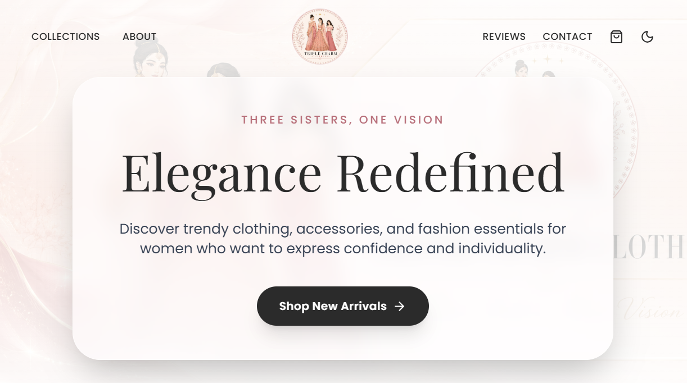

# Triple Charm Clothing

*Three Sisters, One Vision.* 

Triple Charm Clothing is a premium women's fashion brand landing page built with modern web technologies. It offers a sleek, responsive, and elegant user interface tailored for a high-end fashion aesthetic, featuring a beautifully crafted dark mode and engaging micro-interactions.



## ✨ Features

- **Elegant UI/UX:** A luxury aesthetic featuring soft pinks, rose gold, and ivory color palettes.
- **Dark Mode Support:** Seamless toggling between light and dark themes.
- **Interactive Animations:** Powered by Framer Motion for smooth scrolling, fade-ins, and micro-interactions (like the interactive shopping cart floating hearts).
- **Responsive Design:** Fully adaptive layouts from mobile devices to ultra-wide desktop screens using Tailwind CSS.
- **Featured Collections:** Interactive image grids showcasing the latest arrivals.
- **Customer Reviews:** Engaging review carousel/grid.
- **Instagram Gallery:** Visual grid for social media integration.
- **Quick Contact:** Direct WhatsApp and Email links for styling advice and support.

## 🛠 Tech Stack

- **Framework:** [React 18](https://react.dev/) + [Vite](https://vitejs.dev/)
- **Language:** [TypeScript](https://www.typescriptlang.org/)
- **Styling:** [Tailwind CSS](https://tailwindcss.com/)
- **Animations:** [Framer Motion](https://www.framer.com/motion/)
- **Icons:** [Lucide React](https://lucide.dev/)

## 🚀 Getting Started

### Prerequisites
Make sure you have [Node.js](https://nodejs.org/) installed on your machine.

### Installation

1. Clone the repository:
   ```bash
   git clone https://github.com/AshminDhungana/triple-charm.git
   cd triple-charm
   ```

2. Install dependencies:
   ```bash
   npm install
   ```

3. Start the development server:
   ```bash
   npm run dev
   ```

4. Open your browser and visit `http://localhost:3000` (or the port specified by Vite).

## 🚀 Deployment

This project is configured and ready to be deployed on **Vercel**.

1. Push your code to a GitHub repository.
2. Go to [Vercel](https://vercel.com/) and create a new project.
3. Import your GitHub repository.
4. Vercel will automatically detect the **Vite** framework and configure the build settings (`npm run build` and `dist` directory).
5. Click **Deploy**.

*A `vercel.json` file is included to automatically handle client-side routing and fallback to `index.html`.*

## 📁 Project Structure

```text
├── public/               # Static assets
├── src/
│   ├── assets/           # Images and media
│   ├── components/       # Reusable React components (Navbar, Hero, Gallery, etc.)
│   ├── App.tsx           # Main application component layout
│   ├── index.css         # Global styles and Tailwind configuration
│   ├── main.tsx          # Application entry point
│   └── types.d.ts        # TypeScript declaration files
├── index.html            # HTML entry point
├── package.json          # Project metadata and dependencies
├── tsconfig.json         # TypeScript configuration
└── vite.config.ts        # Vite configuration
```

## 📝 License

&copy; 2026 TRIPLE CHARM CLOTHING. Designed By A.D. 
